# AppleMarketplace
My Spring MVC project for the Spring Advanced course at SoftUni. (June 2024)

## About The Project
A platform where you can easily find the perfect device for you or sell your old one, 
with the ability to view detailed specifications, reviews and current offers.

## Technologies and tools used:
- Java 17
- Spring Boot 
- MySQL
- HTML
- CSS
- Bootstrap
- Thymeleaf
- Cloudinary
- Testing (JUnit, Mockito, GreenMail, HSQLDB, Integration Tests)

## Internalization/i18n
1. Bulgarian
2. English

## Configurations:
Prerequisites:
JDK 17
Apache Maven 3.9.7 or higher
To set up and run AppleMarketplace, you need to:
Set up environment variables ${db_username}, ${db_password}, ${EMAIL_RECIPIENT}, ${ADMIN_USERNAME}, ${ADMIN_PASSWORD}

### -Home-
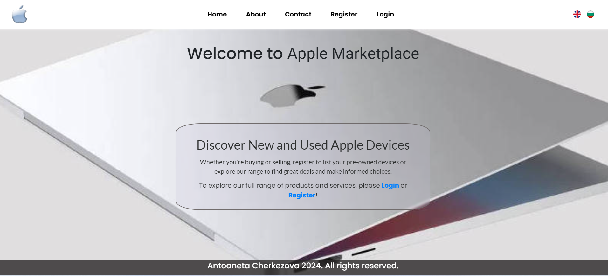

### -About Us-
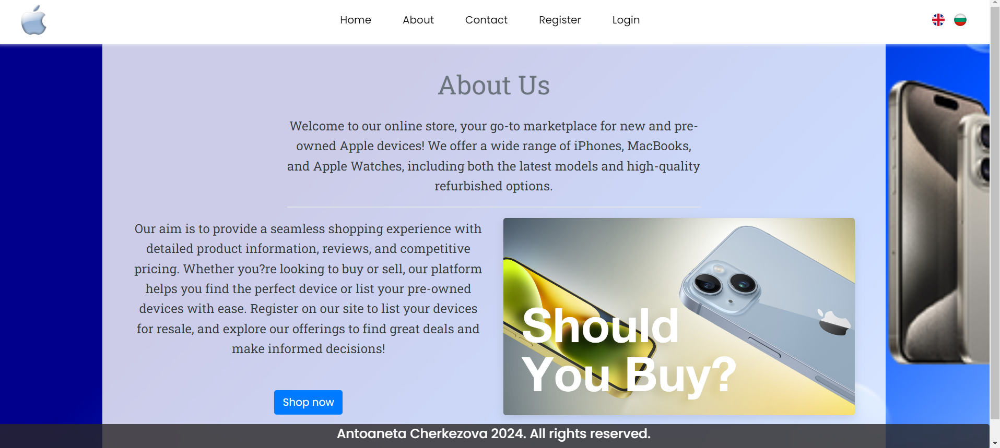

### -Contact Us-
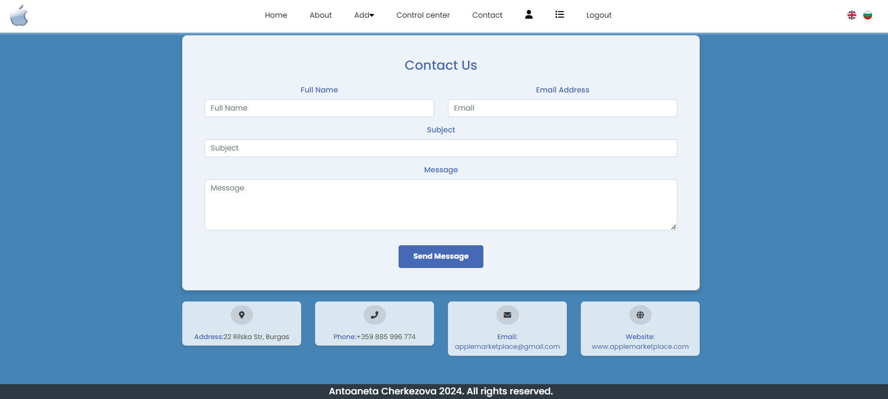

### -Register-
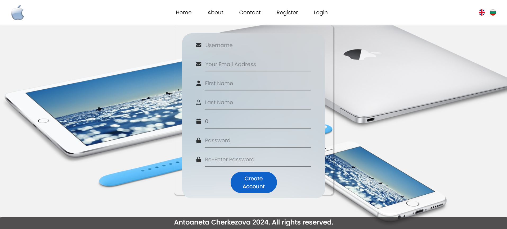

### -Login-
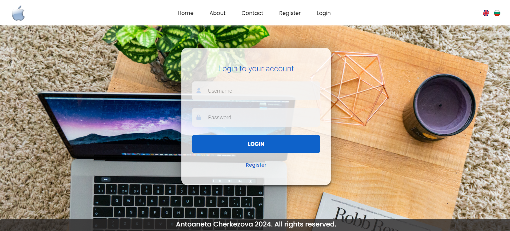

### -Home As User-
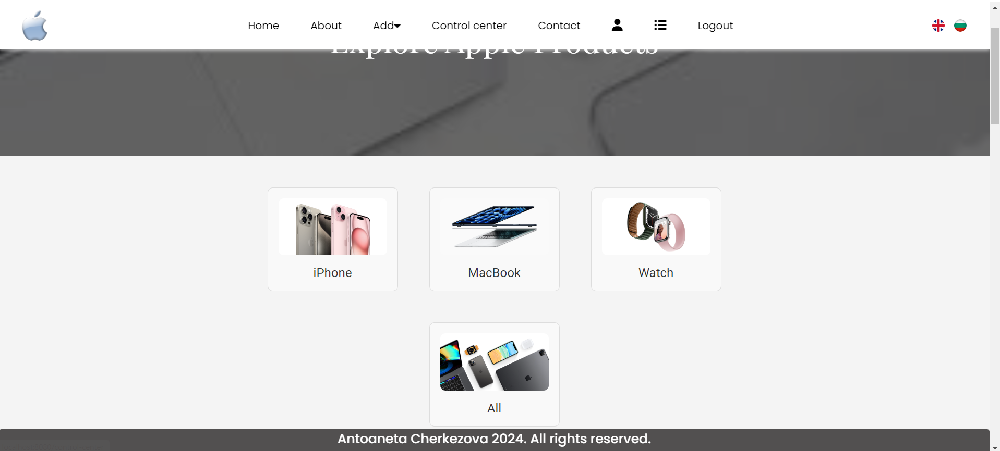
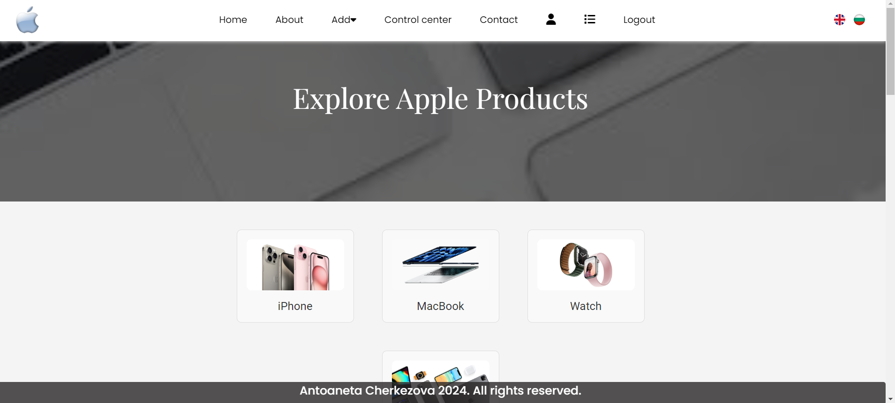
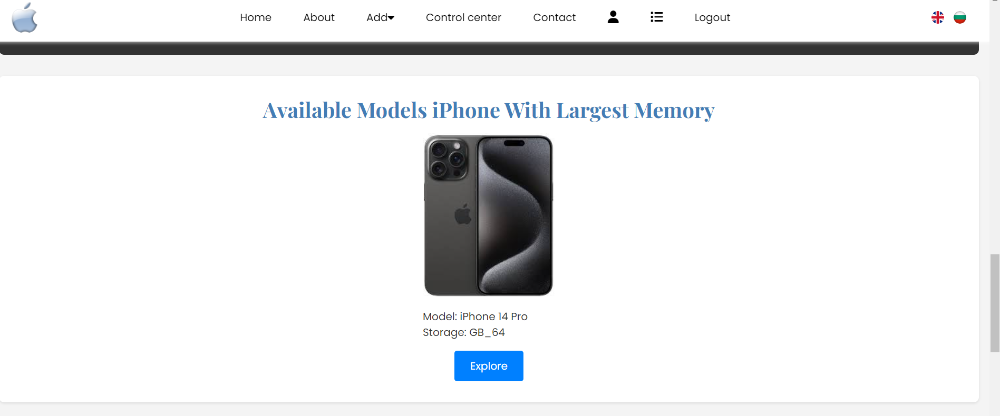
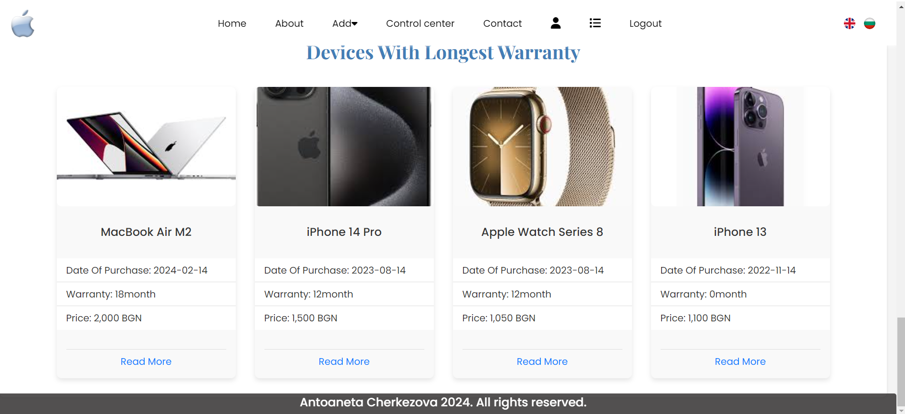

### -Add Devices-
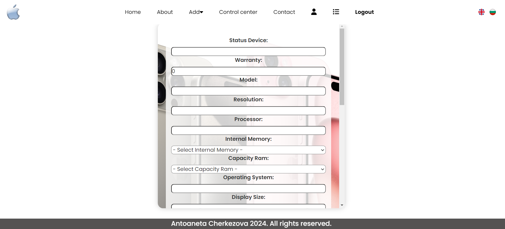
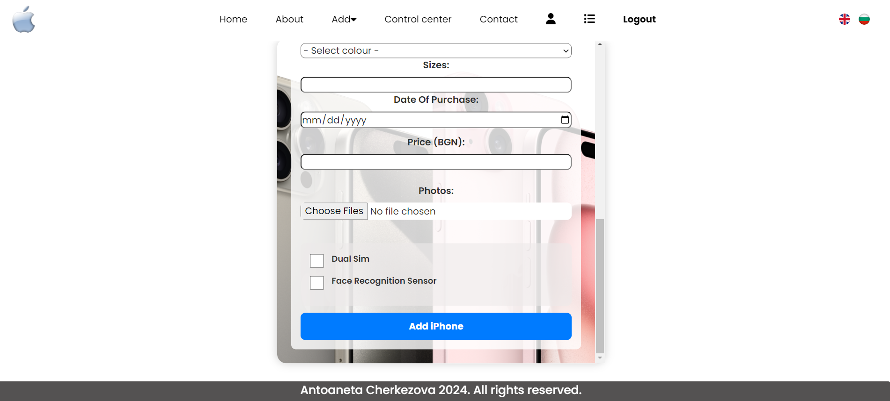
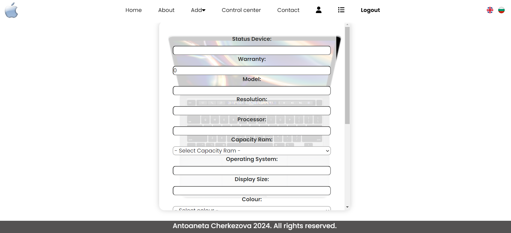
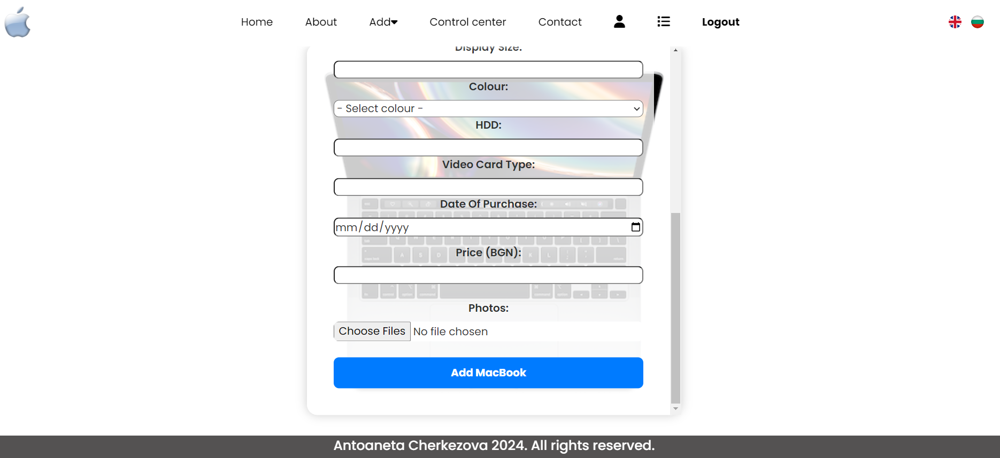
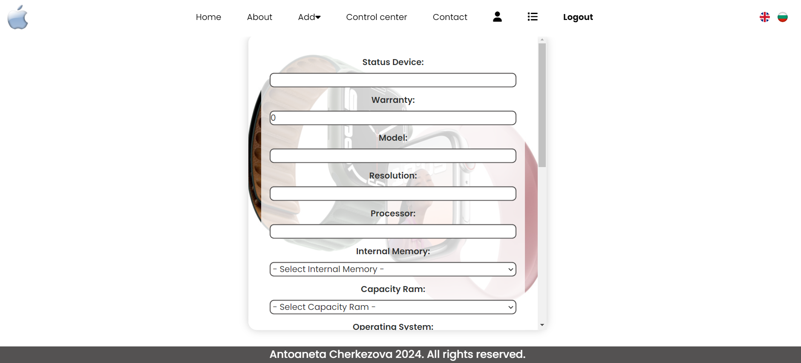
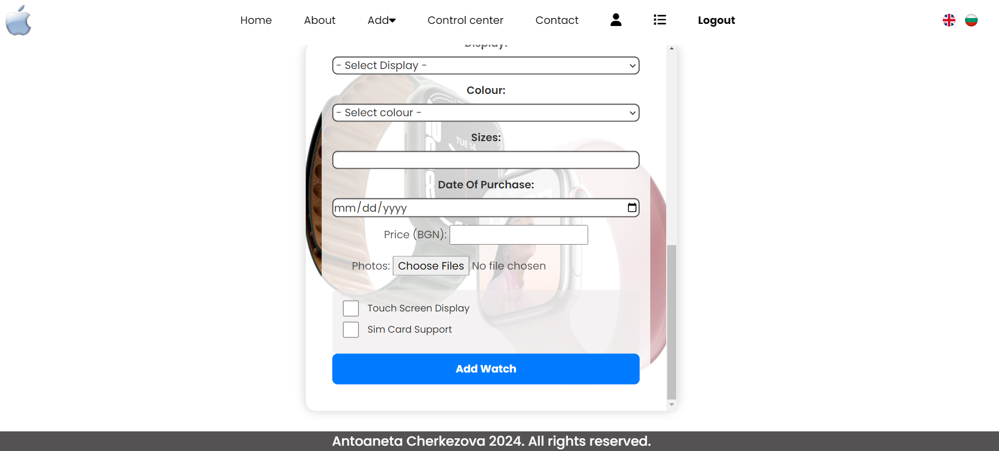

### -Device Profile-
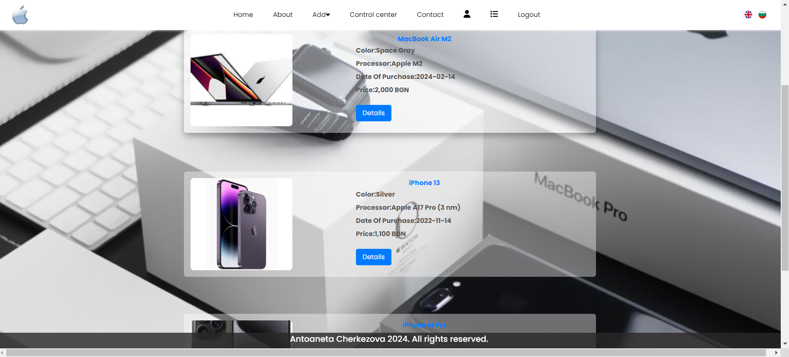
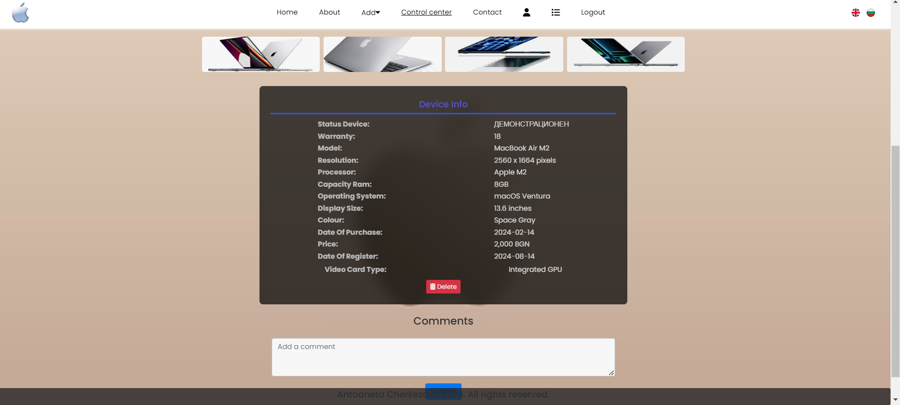

### -Control Center-
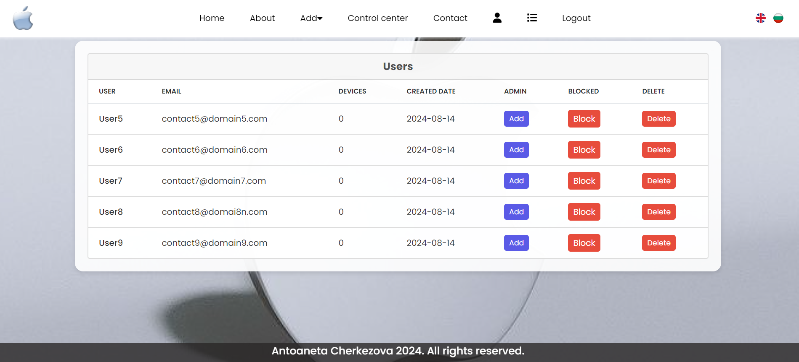

### -User Profile-
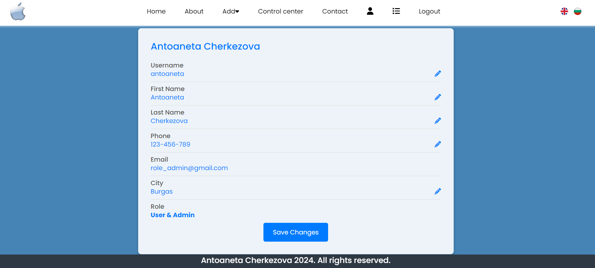

### -My Devices-
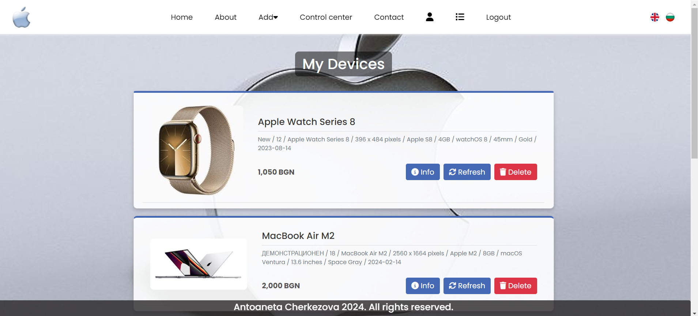